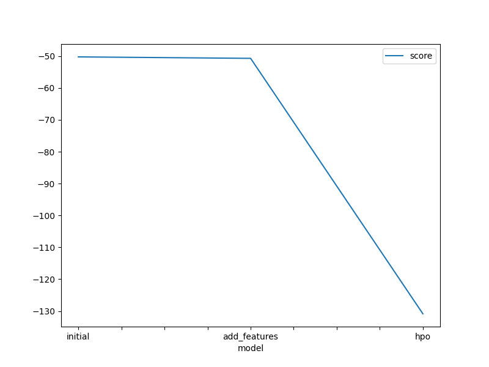

# Report: Predict Bike Sharing Demand with AutoGluon Solution
#### Abdullah Allama

## Initial Training
### What did you realize when you tried to submit your predictions? What changes were needed to the output of the predictor to submit your results?
TODO: Removed Negetive values

### What was the top ranked model that performed?
TODO: WeightedEnsemble_L3

## Exploratory data analysis and feature creation
### What did the exploratory analysis find and how did you add additional features?
TODO: It did tell some interesting facts about the distribution of the wind and humidity, but I realy wanted to try the week days approach

### How much better did your model preform after adding additional features and why do you think that is?
TODO: Surprisngly, It preformed worse (about 0.23 worse) with a score of 1.82964

## Hyper parameter tuning
### How much better did your model preform after trying different hyper parameters?
TODO: compared to the initial (1.80644) it preformed at (1.79506)

### If you were given more time with this dataset, where do you think you would spend more time?
TODO: Maybe trying monthly features or going even deeper into hyper parameter tuning

### Create a table with the models you ran, the hyperparameters modified, and the kaggle score.
	model	hpo1	hpo2	hpo3	score
0	initial	best_quility	best_quility	auto_stack=True	1.80644
1	add_features	time_limit_10m	time_limit_10m	time_limit_20m	1.82964
2	hpo	none	none	num_bag_folds=5	1.79506

### Create a line plot showing the top model score for the three (or more) training runs during the project.

### Create a line plot showing the top kaggle score for the three (or more) prediction submissions during the project.

## Summary
TODO: Using the same paremeter with new features oddly didnt improve the moduple. But it seems that adding more time and more hypertuning did at the end improve the model.

